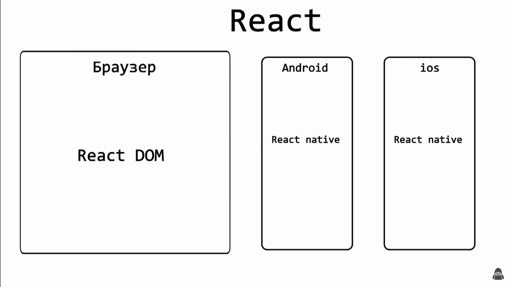
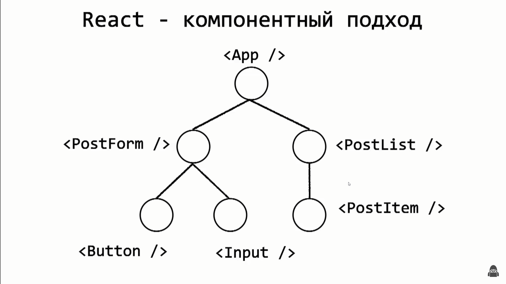
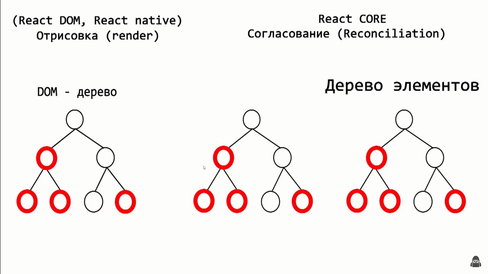
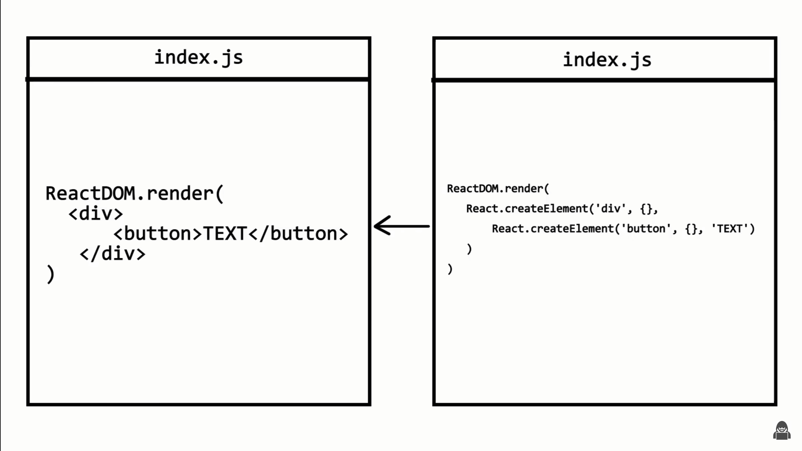

### Введение
Здесь будет записана теоритическая часть и возможно некоторые более подробные объяснения для кода, если я посчитаю нужным развернутость вместо обычных комментариев в файлах.

# React
Реакт спроектирован таким образом что он независим от браузера. Он живет сам по себе и служит для создания пользовательских интерфейсов. А за визуализацию, за рендеринг и за отрисовку реакт компонентов в браузер отвечает библиотека **React DOM**. Благодаря такой реализации Реакта мы можем им также создавать приложения на android ios windows используя **React Native**. Т.об. ядро реакт (*React CORE*) большое кол-во концепций, а за визуал в том или ином окружении отвечают другие библиотеки.
 

## SPA (Single Page Application)
Возьмем работу классических клиентских приложених, это **Multi Page Application**: тут мы создаем несколько хтмл файлов в качестве страниц, у каждого подключены свои какие то скрипты, и между страницами мы переключаемся с помощью специальных ссылок. Из минусов при переходе на новую страницу нам приходится полностью загружать новый хтмл файл, при этом некоторые части (нав панель, футеры, боковые панели) остаются прежними но мы их снова загружаем; если не оптимизировать грамотно приложение, пользователь будет видеть все эти переходы и загрузки заново особенно при плохом интернете.

В то время **SPA** - одностраничные приложения которые реакт нам позволяет разробатывать - всегда имеет один основной хтмл. Он минималистичный, имеет ток какие то мета теги и основные теги типа бади хеда, подключенные скрипты. Все данные приходят из джаваскрипта. Содержимым страницы мы можем управлять как хотим. Из плюсов: быстрая работа, все скрипты мы подключили единожды, нав панели и футеры переподгружать не надо. Из минусов: первичная загрузка будет гораздо больше т.к. нам надо подгрузить намного больше данных изначально, зато потом все будет работать как по маслу. Ну и это тоже можно оптимизировать на самом деле используя WebPack, Lazy Loading и различные хитрости.

## Компонентный подход
...
При таком подходе всегда есть какой то корневой компонент который вмонтируется в индекс хтмл файл. Чаще всего в контексте реакт он называется **_App.js/ts_**
.

## DOM дерево
Когда работаешь напрямую с дом деревом это тратит много сил раздумывая над тем что куда поместить где удалить. Плюс все операции над дом деревом очень ресурсоемкие и тяжелые. 
Реакт же позволяет больше состредотачиваться на логике по работе с данными и при это самостоятельное взаимодействие с DOM деревом минимизировано. Реакт сам следит за обновлением интерфейса. Мы меняем данные - интерфейс под эти данные подстраивается. Причем за этим стоят достаточно сложные оптимизированные механизмы, такие как Согласование, React Fiber, render() функция.

React под капотом строит т.н. виртуальное дом дерево (**Virtual DOM**) - **более легковесная копия обычного дом дерева в браузере**. _(такое название часто используется и документируется, хотя логически может вызывать путаницу, поскольку дом дерево все же подразумевает браузер, а это дерево строится вне зависимости от окружения в котором выполняется код, поэтому сами разрабы предпочитают название <u>Дерево Реакт Элементов</u>, т.к. оно строится не только в браузере, и Виртуал ДОМ не самое подходящее название)._
Когда в каких то узлах этого дерева произошли какие то изменения, они не переносятся в ДОМ дерево сразу. Вместо этого Реакт строит новое дерево элементов с обновленными значениями и сравнивает это дерево с предыдущим. Это стадия **Согласования (Reconciliation)**, за него отвечает ядро Реакта, и оно выполняется вне зависимости от среды выполнения, будь то браузер или телефон.
После того как Реакт нашел разницу между этими двумя деревьями, происходит фаза **рендеринга/отрисовки (render)**, при этом для каждого изменения Реакт устанавливает свою приоритетность, и мы видим плавную картинку с максимальной частотой кадров. За эту фазу отвечает React DOM, React Native.
 


## JSX (JavaScript XML)
**JSX** является расширение Джаваскрипта и упрощает написание кода.
Тут в примере Джаваскрипт кода мы создаем новый Реакт элемент, указываем тип элемента div, в него кладем еще один новый элемент button, вторым параметром можем передать опции, например disabled, третим хз что. 



## Мой код
Тут будут все заметки и примечания связанные с кодом и Реактом.

### Двустороннее связывание
Пример:
```jsx
<h1>{value}</h1>
<input type="text" value={value} onChange={e => setValue(e.target.value)} />
```
То есть мы связали состояние со значением которое находится в Инпуте. Если бы мы его не связали, у нас бы была просто статичная переменна в атрибуте value, и что либо писать в Инпуте было бы невозможно.

Такие компоненты называются **управляемыми**, так как мы всегда можем изменить значение компонента изменив состояние.