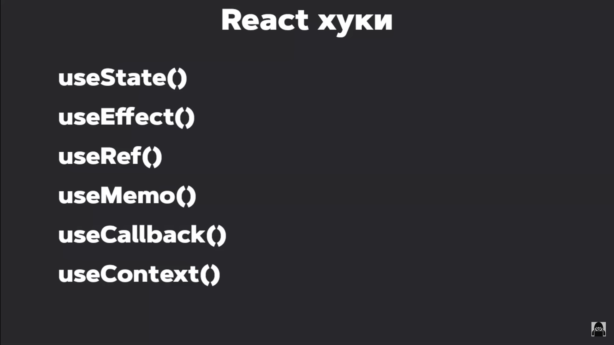
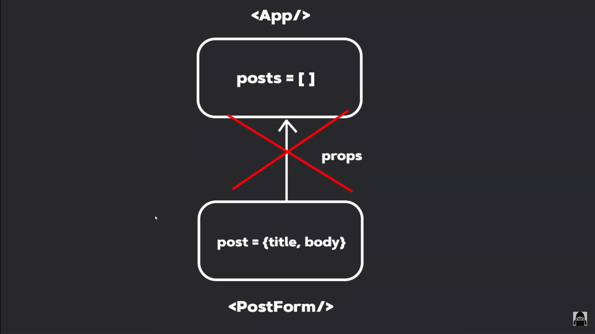
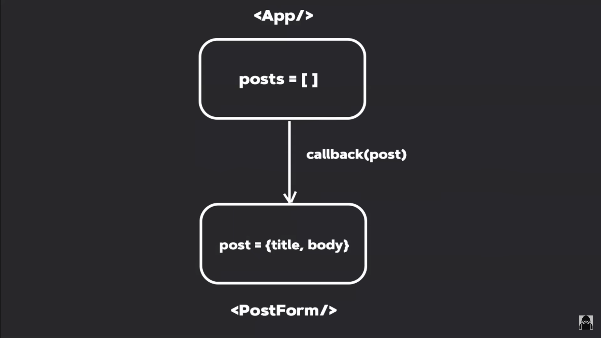

### Введение

Здесь будет записана теоритическая часть и возможно некоторые более подробные объяснения для кода, если я посчитаю нужным развернутость вместо обычных комментариев в файлах.

# React

Реакт спроектирован таким образом что он независим от браузера. Он живет сам по себе и служит для создания пользовательских интерфейсов. А за визуализацию, за рендеринг и за отрисовку реакт компонентов в браузер отвечает библиотека **React DOM**. Благодаря такой реализации Реакта мы можем им также создавать приложения на android ios windows используя **React Native**. Т.об. ядро реакт (_React CORE_) большое кол-во концепций, а за визуал в том или ином окружении отвечают другие библиотеки.


## SPA (Single Page Application)

Возьмем работу классических клиентских приложених, это **Multi Page Application**: тут мы создаем несколько хтмл файлов в качестве страниц, у каждого подключены свои какие то скрипты, и между страницами мы переключаемся с помощью специальных ссылок. Из минусов при переходе на новую страницу нам приходится полностью загружать новый хтмл файл, при этом некоторые части (нав панель, футеры, боковые панели) остаются прежними но мы их снова загружаем; если не оптимизировать грамотно приложение, пользователь будет видеть все эти переходы и загрузки заново особенно при плохом интернете.

В то время **SPA** - одностраничные приложения которые реакт нам позволяет разробатывать - всегда имеет один основной хтмл. Он минималистичный, имеет ток какие то мета теги и основные теги типа бади хеда, подключенные скрипты. Все данные приходят из джаваскрипта. Содержимым страницы мы можем управлять как хотим. Из плюсов: быстрая работа, все скрипты мы подключили единожды, нав панели и футеры переподгружать не надо. Из минусов: первичная загрузка будет гораздо больше т.к. нам надо подгрузить намного больше данных изначально, зато потом все будет работать как по маслу. Ну и это тоже можно оптимизировать на самом деле используя WebPack, Lazy Loading и различные хитрости.

## Компонентный подход

...
При таком подходе всегда есть какой то корневой компонент который вмонтируется в индекс хтмл файл. Чаще всего в контексте реакт он называется **_App.js/ts_**

.

## DOM дерево

Когда работаешь напрямую с дом деревом это тратит много сил раздумывая над тем что куда поместить где удалить. Плюс все операции над дом деревом очень ресурсоемкие и тяжелые.
Реакт же позволяет больше состредотачиваться на логике по работе с данными и при это самостоятельное взаимодействие с DOM деревом минимизировано. Реакт сам следит за обновлением интерфейса. Мы меняем данные - интерфейс под эти данные подстраивается. Причем за этим стоят достаточно сложные оптимизированные механизмы, такие как Согласование, React Fiber, render() функция.

React под капотом строит т.н. виртуальное дом дерево (**Virtual DOM**) - **более легковесная копия обычного дом дерева в браузере**. _(такое название часто используется и документируется, хотя логически может вызывать путаницу, поскольку дом дерево все же подразумевает браузер, а это дерево строится вне зависимости от окружения в котором выполняется код, поэтому сами разрабы предпочитают название <u>Дерево Реакт Элементов</u>, т.к. оно строится не только в браузере, и Виртуал ДОМ не самое подходящее название)._
Когда в каких то узлах этого дерева произошли какие то изменения, они не переносятся в ДОМ дерево сразу. Вместо этого Реакт строит новое дерево элементов с обновленными значениями и сравнивает это дерево с предыдущим. Это стадия **Согласования (Reconciliation)**, за него отвечает ядро Реакта, и оно выполняется вне зависимости от среды выполнения, будь то браузер или телефон.
После того как Реакт нашел разницу между этими двумя деревьями, происходит фаза **рендеринга/отрисовки (render)**, при этом для каждого изменения Реакт устанавливает свою приоритетность, и мы видим плавную картинку с максимальной частотой кадров. За эту фазу отвечает React DOM, React Native.


## JSX (JavaScript XML)

**JSX** является расширение Джаваскрипта и упрощает написание кода.
Тут в примере Джаваскрипт кода мы создаем новый Реакт элемент, указываем тип элемента div, в него кладем еще один новый элемент button, вторым параметром можем передать опции, например disabled, третим хз что.


## Хуки

Хуки это некоторые функции которые предоставляет Реакт. Они всегда начинаются со слова _use_. Хуки можно использовать в функциональных компонентах либо в своих собственных хуках. Стандартный всего 6 штук:



То есть на их основании мы можем делать собственные хуки, со своим различным функционалом.
**ВАЖНО!** Хуки можно использовать только на верхнем уровне вложенности. То есть мы не можем вкладывать их в какие то функции, условия, циклы. Только на верхнем уровне вложенности компонента или кастомного хука.

## Мой код

Тут будут все заметки и примечания связанные с кодом и Реактом.

### Двустороннее связывание

Пример:

```jsx
<h1>{value}</h1>
<input type="text" value={value} onChange={e => setValue(e.target.value)} />
```

То есть мы связали состояние со значением которое находится в Инпуте. Если бы мы его не связали, у нас бы была просто статичная переменна в атрибуте value, и что либо писать в Инпуте было бы невозможно.

Такие компоненты называются **управляемыми**, так как мы всегда можем изменить значение компонента изменив состояние.

### Key attr

При создании списков обязательным условием является указание некоторого ключа, - **key** - который предназначен для хранения уникального значения. Как правило это _id_ используемого объекта.
Пример:

```jsx
{
  posts.map((post) => <PostItem key={post.id} post={post} />);
}
```

Начинающие часто используют для инициализации ключа индекс объекта, подразумевая что он так же уникальный, но его использовать не рекомендуется, поскольку при удалении и добавлении новых элементов массива индекс как бы съезжает, меняя значения key, их идентификатора, у элементов. Key должен быть статичным и постоянным.
Ключи позволяют алгоритмам Реакта наиболее эффективно делать рендеринг и перерисовывать не весь список а только те элементы где произошли изменения.

### dirs

Папка `./components/UI` создана для графических компонентов, таких как Инпуты, кнопки, анимании загрузки и так далее. Там находятся папки для каждого такого компонента, внутри которых в данном проекте есть два файла: сам jsx реакт компонент и его стилизация через модули css, например MyButton.module.css.

Модули css созданы для генерации уникального названия класса в зависимости от модуля который мы сделали.
Пример:

```jsx
// в этом файле создан обычный класс myBtn, который мы экспортируем как объект из файла css, и класс как его свойство.
import classes from './MyButton.module.css';

const MyButton = (props) => {
  return (
    <button className={classes.myBtn}>
    {/*
    а по итогу в хтмл кнопка будет выглядеть с таким классом:
    // <button class="MyButton_myBtn__uBNNk">
    */}
  )};
```

Таким образом мы можем добиться изоляции стилей не используя какой нибудь BEM методологии (или БЭМ - соглашение об именовании классов, Блок-Элемент-Модификатор).
К примеру у нас было бы какое то всплывающее окно и выпадающий список. И у того и у другого есть класс `active`, т.е когда элемент "активен" модальное окно открывается. И если сделать все коряво, на элемент может наложиться не тот стиль, и для этого как раз нужна изоляция.

### Управляемые и Неуправляемые компоненты. useRef()

Хук useRef используется для неуправляемых элементов. В useRef кладут значения, которые нужно сохранить между рендерами, но при этом не вызывать повторный рендер при их изменении. С помощью него можно получить доступ к DOM элементу откуда уже вытянем `value`. Созданную ссылку передаем через атрибут `ref={}` к нужному элементу. У нее есть всего одно поле current, которое и представляет собой элемент. У элемента естественно есть нужное поле `value` (`bodyInputRef.current.value`). Хотя в целом, манипулировать ДОМ деревом не рекомендуется.

```jsx
const bodyInputRef = useRef()
  <MyInput
          type="text"
          ref={bodyInputRef}
          // value={body}
          // onChange={(e) => setBody(e.target.value)}
          placeholder="Описание поста"
        />
```

Это топ, но для созданных компонентов допов надо будет указать `React.forwardRef((props, ref))` и далее куда надо передать его: `ref={ref}`.

### Обмен данными между компонентами. Props

Пропсы (`Props`) - Это некоторые аргументы, некоторые параметры которые может принимать компонент извне. Но обмен этими пропсами идет всегда сверху вниз, то есть от родителя к дочернему компоненту. Например, мы из компонента `<App />` передавали список постов в компонент `<PostList />`.
Но бывает необходимым передавать данные наоборот, снизу вверх. К примеру, сейчас надо передать данные о посте из компонента `<PostForm />` в `<App />`, чтобы мы могли добавить новый пост в список постов. Однако через пропсы этого не сделать.



Но мы можем сделать следующее: из родительского компонента можем в дочерний передать некоторый _callback_ (функция обратного вызова). В данном случая она будет ожидать на вход пост, его данные передадим аргументами. Значит, вызываем эту функцию в дочернем элементе и передаем все необходимое, что будем использовать выше.



### Кэширование. useMemo(callback, deps)

Первым параметром хук useMemo принимает коллбэк, а вторым массив зависимостей. Коллбек должен возвращать результат каких то вычисление. В массив зависимостей можно передавать какие то переменные, поля объекта и т.п. Хук производит вычесления, запоминает их и кэширует (_мемоизация_). Так что на каждую перерисовку компонента она не пересчитывает заново, а достает данные из кэша. Но каждый раз когда происходят изменения в зависимостях, хук снова отрабатывает: производит вычисления и кэширует. Если массив зависимостей пустой, функция отработает единожды, запомнит результ и больше вызвана не будет.
Пример:

```jsx
const sortedPosts = useMemo(() => {
    console.log("Функция отработала");
    
    // просто механизм сортировки
    if (selectedSort) {
      [...posts].sort((a, b) => a[selectedSort].localeCompare(selectedSort));
    }
    return posts;
  }, [selectedSort, posts]);
```

Если бы мы не мемоизировали данную логику, то при любом обновлении компонента (в данном случае `App.jsx`) у нас происходила бы сортировка, т.к. мы передаем `sortedPosts` переменную с функцией сортировки в качестве массива отрисовывающихся постов: <u>*ререндер => вызов функции => сортировка => вывод этих постов.*</u>
```jsx
  function getSortedPosts() {
    // просто механизм сортировки
    ...
  }

  const sortedPosts = getSortedPosts();

  // ...
  <PostForm create={createPost} />
  <MyInput
    // value={searchQuery}
    // onChange={(e) => setSearchQuery(e.target.value)}
    // placeholder="Поиск..."
  />
  posts.length ? (
        <PostList
          posts={sortedPosts}
          ...
        />
      ) : ...
```
К примеру при отправке формы, или любом вводе значения в инпут, хук бы отрабатывал. В первом случае это ну логично но проще отслеживать по изменению массива постов, при втором бьет в производительность будь у нас сотни таких постов. Изменения вообще любых других компонентов в `App.jsx` также бы вызывали сортировку, что является нелогичным.

### Анимации. react-transition-group
Предоставляет простые компоненты, полезные для определения входящих и выходящих переходов. [React Transition](https://reactcommunity.org/react-transition-group/) Group не является библиотекой анимации, как React-Motion, и сама по себе не анимирует стили. Вместо этого она предоставляет этапы переходов, управляет классами и элементами групп, а также манипулирует DOM различными полезными способами, значительно упрощая реализацию визуальных переходов.
Анимировать списки, отслеживать фазы анимации и тд...
Для установки:
```bash
npm install react-transition-group --save # (необяз уже. Устанавливает в deps)
```
Использование описано в документации.

### Жизненный цикл компонента. useEffect(cb, deps)
Каждый компонент обладает своим жизненным циклом и он проходит в три этапа:
1. Монтирование (mount) - когда создается компонент и монтируется в ДОМ дерево. Момент когда мы можем сделать первичную загрузку данных, повесить слушатели события.
2. Обновление (update) - например мы изменили состояние, произошел перерендер/обновление. То есть это стадия активной жизни компонента, когда он работает, мы его видим и он живет. Тут можем следить за изменением каких либо зависимостей и производить различные действия.
3. Размонтирование (unmount) - удаление/скрытие компонента. Например мы хотим его скрыть, или же мы переходим на другую страницу и за ненадобностью Реакт его уничтожает. Тут делаем очистку: отписываемся от слушателей события, очищаем глобальное хранилище.

Получается у нас есть 3 стадии, и за каждой из них можно наблюдать. Для этого используется встроенный хук `useEffect()`. Если в зависимости мы передадим пустой список, хук отработает лишь единожды на этапе монтирования. Для того чтобы следить за изменениями, надо добавить какие то зависимости в массив. При их изменении отрабатывает коллбек. И за стадией размонтирования мы так же может смотреть с помощью `useEffect()`: Если коллбэк возвращает какую то функцию, то она будет вызвана в момент демонтирования компонента.  

Пример:
```jsx
useEffect(() => {
  fetchPosts()

  return () => {
    // ДЕЛАЕМ ОЧИСТКУ
  }
}, [filter])
